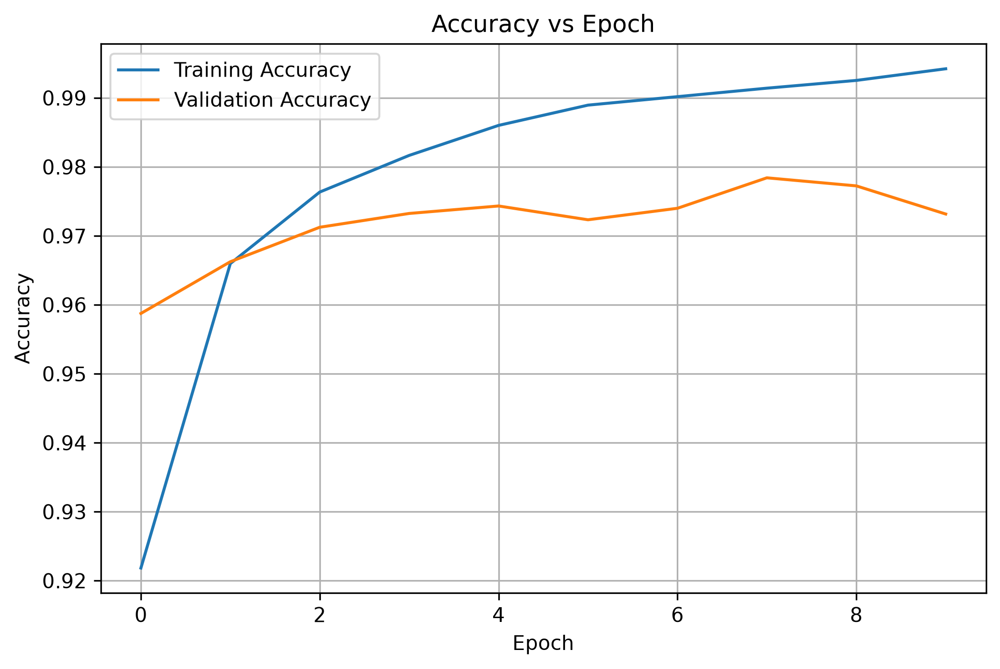
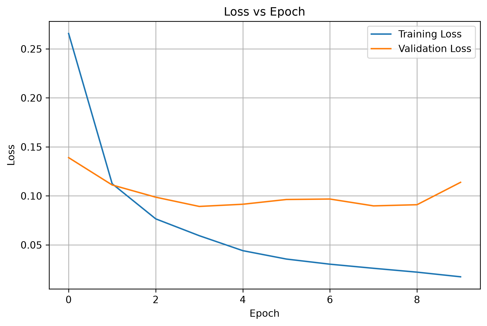
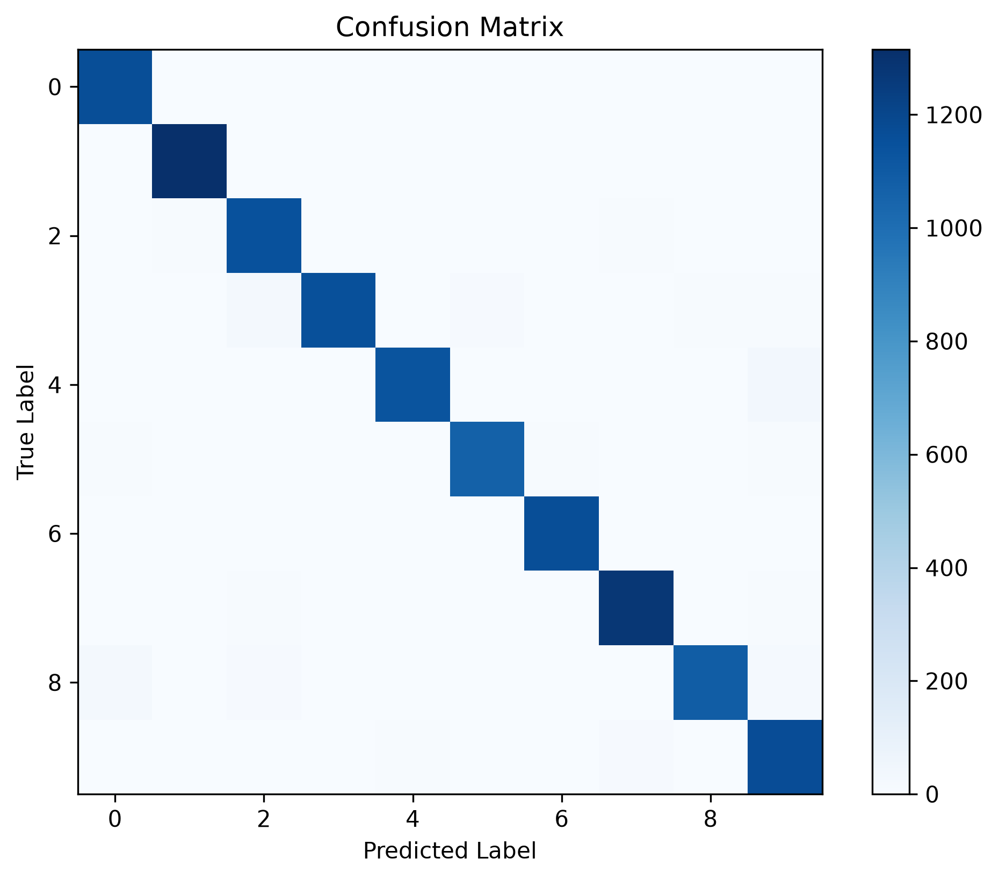

# Handwritten Digit Recognition using Artificial Neural Networks (ANN)

## Objective

The objective of this project is to develop an Artificial Neural Network (ANN) that can accurately recognize handwritten digits (0–9) using the MNIST dataset. The model is trained using TensorFlow/Keras and evaluated using various performance metrics.

---

## Dataset

**MNIST Handwritten Digits Dataset**

Kaggle Dataset:
https://www.kaggle.com/datasets/oddrationale/mnist-in-csv

---

## Libraries Used

- Python
- Pandas
- NumPy
- Matplotlib
- Scikit-learn
- TensorFlow
- Keras

---

## Methodology

1. Loaded the MNIST dataset using Pandas.
2. Displayed the first five records.
3. Identified the input features and target variable.
4. Checked for missing values.
5. Normalized the pixel values.
6. Split the dataset into training and testing sets.
7. Converted labels into one-hot encoded vectors.
8. Built an Artificial Neural Network using TensorFlow/Keras.
9. Trained the model for 10 epochs.
10. Evaluated the model using multiple evaluation metrics.

---

## Model Architecture

Input Layer

↓

Dense Layer (128 Neurons, ReLU)

↓

Dense Layer (64 Neurons, ReLU)

↓

Output Layer (10 Neurons, Softmax)

Optimizer : Adam

Loss Function : Categorical Crossentropy

Evaluation Metric : Accuracy

Epochs : 10

---

## Results

The ANN achieved high classification accuracy on the MNIST test dataset.

The model evaluation includes:

- Test Accuracy
- Confusion Matrix
- Classification Report
- Accuracy vs Epoch Graph
- Loss vs Epoch Graph

### Accuracy vs Epoch

### Loss vs Epoch

### Confusion Matrix

---

## Conclusion

The ANN model successfully classified handwritten digits with high accuracy. Hidden layers helped the model learn complex patterns from the images, improving classification performance. Deep Learning automatically learns features from raw data, making it more powerful than many traditional machine learning techniques. However, ANN models require more computational resources and training data. Overall, the model met the objective of accurately recognizing handwritten digits.